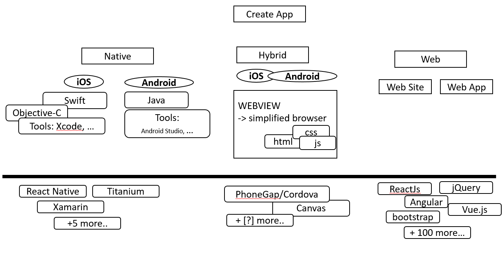

# Using WebView in native hybrid application 

Here is the code samples and the notes about my presentation in the FMI (Faculty of Mathematics and Informatics in Sofia University) course about [Swift].

# The big picture 

# App types and specifics 
What is imporatnt to conside when we start

# Code sample  

	npm i
	
//Development
webpack
webpack-dev-server

// prod build
webpack -p
webpack --progress -p
+ remove source map settings!!!

[Swift]: https://github.com/SwiftFMI/iOS_2017_2018